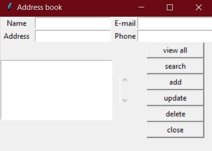

# Address-book
This is an app that can be used to manage addresses and phone numbers using simple clicking and typing and it's easy to use with no complications

## Technolgies used
* Tkinter
* SQLite
* Python

## How to use
Use the package manager [pip](https://pip.pypa.io/en/stable/) to install Tkinter.
```bash
pip install tkinter
```

Start your app using
```bash
python frontend.py
```

## Screenshot

